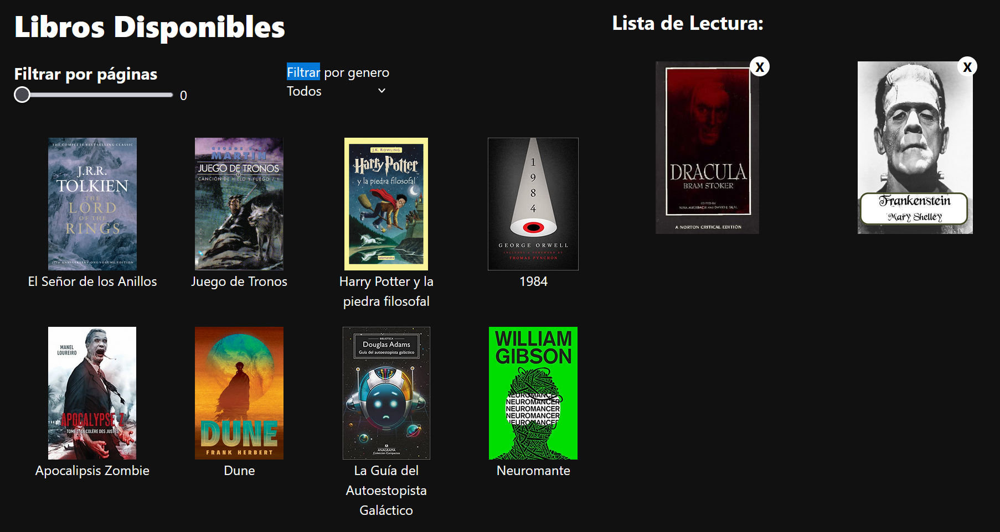

# 📚 Biblioteca de Libros Interactiva

Una aplicación web desarrollada con React + TypeScript + TailwindCSS que permite visualizar, filtrar y seleccionar libros. Puedes filtrar por número de páginas, género, y marcar libros como leídos.

## 🚀 Funcionalidades

- Mostrar una lista de libros disponibles.
- Filtrar libros por:
  - Número de páginas (rango con slider).
  - Género (desplegable sin duplicados).
- Marcar libros como "leídos" haciendo clic en la portada.
- Visualizar libros leídos en una sección separada.
- Eliminar libros leídos.

## 🛠️ Tecnologías utilizadas

- [React](https://reactjs.org/)
- [TypeScript](https://www.typescriptlang.org/)
- [TailwindCSS](https://tailwindcss.com/)
- [Vite](https://vitejs.dev/) (para el entorno de desarrollo)
- `pnpm` como gestor de paquetes (opcional)

## 📸 Captura del Proyecto

## 🌐 Link del Proyecto

[Link al Proyecto](https://bookslibra.netlify.app)
